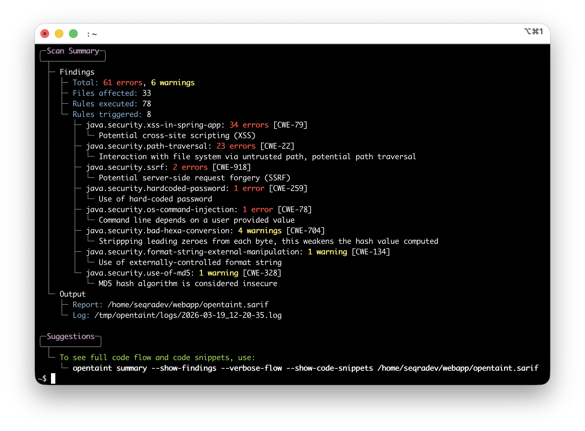
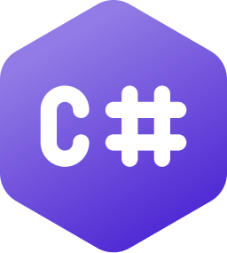
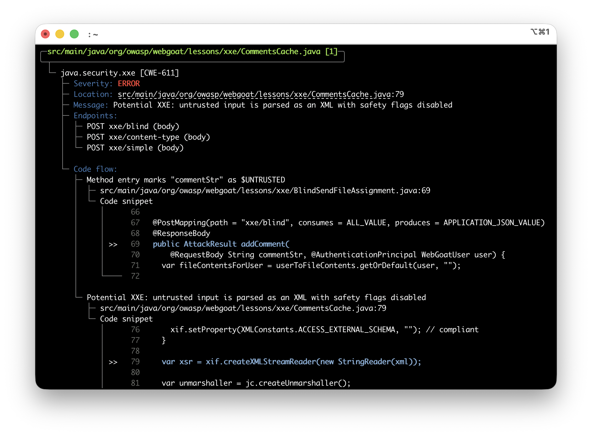
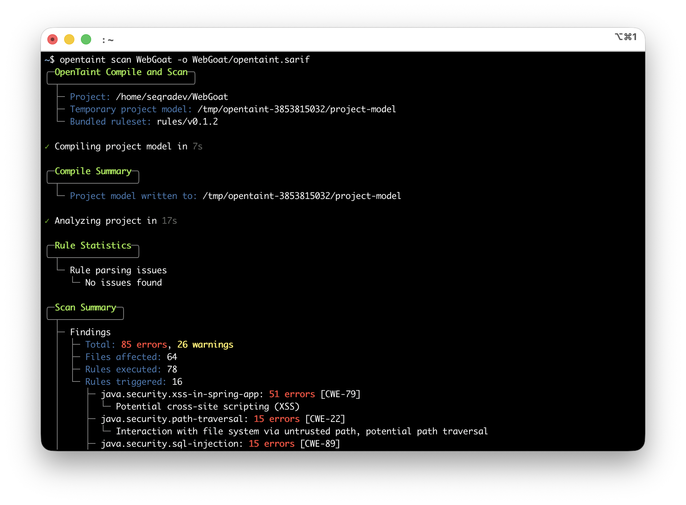
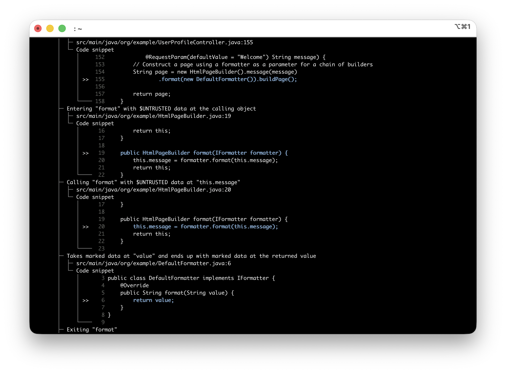
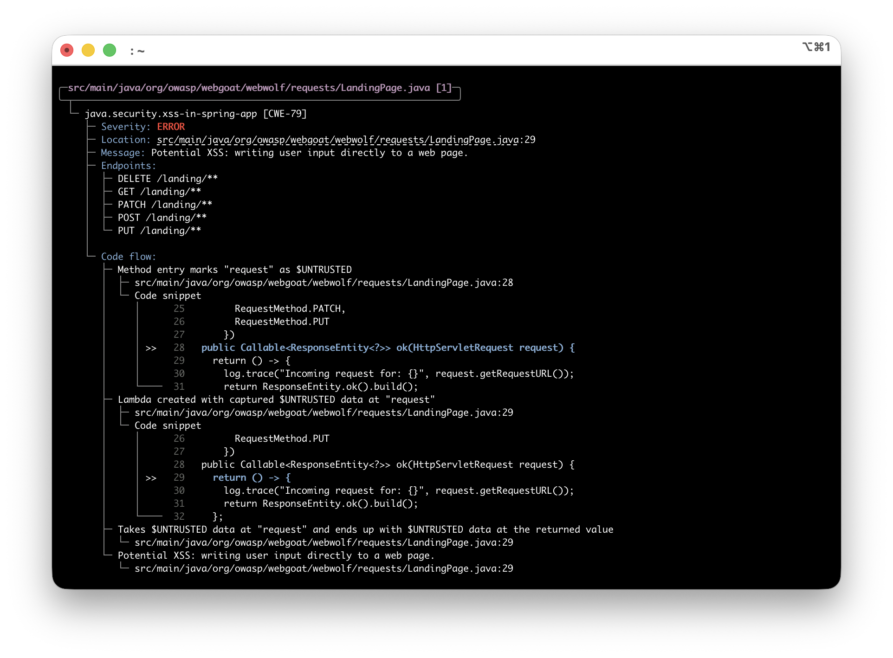

<p align="center">
  <picture>
    <source media="(prefers-color-scheme: dark)" srcset="../logos/opentaint-logo-dark.svg">
    <source media="(prefers-color-scheme: light)" srcset="../logos/opentaint-logo-light.svg">
    
  </picture>
</p>

<p align="center">
  <a href="../README.md">English</a> | <a href="README.zh.md">简体中文</a> | <a href="README.zht.md">繁體中文</a> | <a href="README.ko.md">한국어</a> | <a href="README.de.md">Deutsch</a> | <a href="README.es.md">Español</a> | <a href="README.fr.md">Français</a> | <a href="README.it.md">Italiano</a> | <a href="README.da.md">Dansk</a> | <a href="README.ja.md">日本語</a> | <a href="README.pl.md">Polski</a> | <a href="README.ru.md">Русский</a> | <a href="README.bs.md">Bosanski</a> | <a href="README.ar.md">العربية</a> | <a href="README.no.md">Norsk</a> | <a href="README.br.md">Português (Brasil)</a> | <a href="README.th.md">ไทย</a> | <a href="README.tr.md">Türkçe</a> | <a href="README.ua.md">Українська</a> | <a href="README.bn.md">বাংলা</a> | <a href="README.gr.md">Ελληνικά</a> | <a href="README.vi.md">Tiếng Việt</a>
</p>

<h3 align="center">AI 시대를 위한 오픈 소스 오염 분석 엔진</h3>

<p align="center">
  정형적 프로시저 간 오염 분석 — 패턴 매칭 엔진이 놓치는 것을 찾아내고, LLM 에이전트가 발견한 규칙을 실행하며, 어느 쪽도 단독으로는 불가능한 규모로 확장합니다.
</p>

<p align="center">
  <a href="https://github.com/seqra/opentaint/releases"></a>
  <a href="https://goreportcard.com/report/github.com/seqra/opentaint/cli"></a>
  <a href="../LICENSE.md"></a>
  <a href="https://golang.org/"></a>
  <a href="https://discord.gg/6BXDfbP4p9"></a>
</p>

<p align="center">
<a href="http://opentaint.org/">
<a href="http://opentaint.org/">
<picture>
  <source media="(prefers-color-scheme: dark)" srcset="../public/opentaint-frame-light-2.png">
  <source media="(prefers-color-scheme: light)" srcset="../public/opentaint-frame-dark-2.png">
  
</picture>
</a>
</a>
</p>

<p align="center"><b>지원되는 기술 및 통합</b></p>
<p align="center">
  &nbsp;&nbsp;&nbsp;&nbsp;
  &nbsp;&nbsp;&nbsp;&nbsp;
  &nbsp;&nbsp;&nbsp;&nbsp;
  <picture>
    <source media="(prefers-color-scheme: dark)" srcset="../logos/github-logo-dark.svg">
    <source media="(prefers-color-scheme: light)" srcset="../logos/github-logo-light.svg">
    
  </picture>&nbsp;&nbsp;&nbsp;&nbsp;
  
</p>

<p align="center"><b>로드맵</b></p>
<p align="center">
  &nbsp;&nbsp;&nbsp;&nbsp;
  &nbsp;&nbsp;&nbsp;&nbsp;
  &nbsp;&nbsp;&nbsp;&nbsp;
  &nbsp;&nbsp;&nbsp;&nbsp;
  
</p>

<div align="center">
<details>
  <summary><b>더 많은 스크린샷</b></summary>
  <p align="center">
    <picture>
      <source media="(prefers-color-scheme: dark)" srcset="../public/opentaint-frame-light-1.png">
      <source media="(prefers-color-scheme: light)" srcset="../public/opentaint-frame-dark-1.png">
      
    </picture>
  </p>
  <p align="center">
    <picture>
      <source media="(prefers-color-scheme: dark)" srcset="../public/opentaint-frame-light-3.png">
      <source media="(prefers-color-scheme: light)" srcset="../public/opentaint-frame-dark-3.png">
      
    </picture>
  </p>
  <p align="center">
    <picture>
      <source media="(prefers-color-scheme: dark)" srcset="../public/opentaint-frame-light-4.png">
      <source media="(prefers-color-scheme: light)" srcset="../public/opentaint-frame-dark-4.png">
      
    </picture>
  </p>
  <p align="center">
    <picture>
      <source media="(prefers-color-scheme: dark)" srcset="../public/opentaint-frame-light-5.png">
      <source media="(prefers-color-scheme: light)" srcset="../public/opentaint-frame-dark-5.png">
      
    </picture>
  </p>
</details>
</div>

---

## OpenTaint을 사용해야 하는 이유

AI는 오늘날의 보안 도구가 따라잡을 수 없는 속도로 프로덕션 코드를 생성합니다.

LLM 보안 에이전트는 사람이 놓치는 취약점을 찾아내지만, 모든 파일에 토큰을 소모하면서도 모든 것을 잡아낸다고 보장할 수 없습니다.

AI가 코드를 더 많이 작성할수록, 그 아래에 정형적 방법이 더 필요합니다.

- **패턴 매칭 엔진이 놓치는 것을 찾아냅니다.** 프로시저 간 데이터플로우 엔진은 함수 경계, 영속성 계층, 별칭, 비동기 코드를 가로질러 신뢰할 수 없는 데이터를 추적합니다.
- **하나의 발견이 전체 커버리지가 됩니다.** 코드 네이티브 규칙을 통해 발견된 모든 취약점을 규칙으로 만들 수 있으며, 엔진이 이를 전체 코드베이스에 걸쳐 결정론적으로, 수 분의 CPU 시간 내에 적용합니다.
- **오픈 소스, 모든 것이 포함되어 있습니다.** 엔진, 규칙, CI 통합 — 전체 스택이 Apache 2.0 및 MIT 라이선스로 제공됩니다. 오염 추적을 잠금 해제하기 위한 유료 티어도, 자체 규칙 작성에 대한 제한도 없습니다.

## 빠른 시작

**설치 스크립트 (Linux/macOS)**
```
curl -fsSL https://raw.githubusercontent.com/seqra/opentaint/main/scripts/install/install.sh | bash
```

**Homebrew를 통한 설치 (Linux/macOS):**
```bash
brew install --cask seqra/tap/opentaint
```

**설치 스크립트 (Windows PowerShell)**
```
irm https://raw.githubusercontent.com/seqra/opentaint/main/scripts/install/install.ps1 | iex
```

**프로젝트 스캔:**
```bash
opentaint scan --output results.sarif /path/to/your/spring/project
```

**또는 Docker 사용:**
```bash
docker run --rm -v $(pwd):/project -v $(pwd):/output \
  ghcr.io/seqra/opentaint:latest \
  opentaint scan --output /output/results.sarif /project
```

더 많은 옵션은 [설치](../docs/README.md#installation) 및 [사용법](../docs/README.md#usage)을 참조하세요.

---

## 문서

전체 가이드 — 설치, 사용법, 구성, CI/CD 통합: **[문서](../docs/README.md)**.

## 지원

- **이슈:** [GitHub Issues](https://github.com/seqra/opentaint/issues)
- **커뮤니티:** [Discord](https://discord.gg/6BXDfbP4p9)
- **이메일:** [seqradev@gmail.com](mailto:seqradev@gmail.com)

## 라이선스

[핵심 분석 엔진](../core/)은 [Apache 2.0 라이선스](../LICENSE.md)로 배포됩니다. [CLI](../cli/), [GitHub Action](../github/), [GitLab CI 템플릿](../gitlab/), [규칙](../rules/)은 [MIT 라이선스](../cli/LICENSE)로 배포됩니다.
